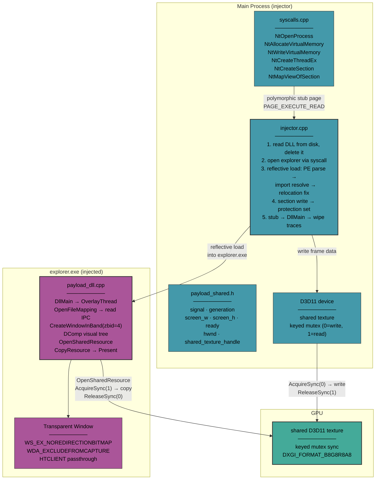

# Reflective DLL Injector

Load a DLL into a process without touching `LoadLibrary`, present a window through the compositor without `WS_EX_LAYERED`, and wipe traces of both — all through direct syscalls.

---


## The pipeline

```
Main process
    │
    ├─ Read DLL from disk, then delete it
    ├─ Open target process (explorer.exe) via direct syscall
    │
    ├─ Reflective load DLL into target
    │   ├─ Manual PE mapping (no LoadLibrary, no PEB entry)
    │   ├─ Section copying to correct virtual addresses
    │   ├─ Import resolution using target's own loaded modules
    │   ├─ Base relocations applied
    │   ├─ PE headers wiped after DllMain returns
    │   └─ Loader stub zeroed and freed
    │
    ├─ Shared memory + named event (PID-derived names, unpredictable)
    │
    ├─ Injected DLL creates transparent window
    │   ├─ CreateWindowInBand(zbid=4) for compositor isolation
    │   ├─ DComp visual target — not WS_EX_LAYERED
    │   ├─ WS_EX_NOREDIRECTIONBITMAP (bypass DWM surface copy)
    │   ├─ SetWindowDisplayAffinity(WDA_EXCLUDEFROMCAPTURE)
    │   ├─ WM_NCHITTEST → HTCLIENT (click passthrough)
    │
    ├─ Shared D3D11 texture with IDXGIKeyedMutex
    │   ├─ Main process writes to shared texture
    │   ├─ Injected DLL copies to swapchain, presents via DComp
    │   └─ GPU frames attributed to target process, not ours
    │
    └─ Cleanup: signal DLL exit, free remote memory, close handles
```

## What each technique defeats

| Technique | What it evades |
|---|---|
| **Reflective loading** | `LoadLibrary` detection, PEB module list, `PsSetLoadImageNotifyRoutine` |
| **PE header wipe** | Memory forensics — no PE signature after DllMain |
| **Stub wipe** | Post-hoc analysis — loader stub gone after execution |
| **DLL deleted from disk** | File system scanning |
| **Inject into explorer.exe** | Process tree analysis — children of explorer are normal |
| **CreateWindowInBand** | Compositor band mixing — renders in dedicated Z-band |
| **DComp visual** | Classic overlay detection — no `WS_EX_LAYERED` |
| **WS_EX_NOREDIRECTIONBITMAP** | DWM redirection surface |
| **SetWindowDisplayAffinity** | Screen capture — blocked for OBS, Game Bar, Discord, PrintScreen |
| **Keyed mutex texture sharing** | GPU process attribution — `Present()` called from target process |
| **Direct syscalls** | User-mode API hooks in ntdll.dll |
| **PID-derived IPC names** | Static named object detection |
| **Runtime string obfuscation** | Static binary analysis — no plaintext API names |

## Structure

```
src/injector/
├── injector.cpp           # Reflective loader, shared memory, stub execution
├── injector.h             # DllOverlayContext
├── reflective_loader.h    # PE parser, relocations, import resolver
├── payload_dll.cpp        # Injected DLL — DComp window, texture IPC, frame loop
├── payload_shared.h       # Cross-process shared memory struct
├── syscalls.cpp           # Direct syscall gadget, stubs, Nt* wrappers
├── syscalls.h
├── common.h               # Logging, XOR string helper
└── stealth_strings.h      # Runtime string obfuscation

docs/                      # Architecture writeups
```

## Building

Visual Studio 2022 + Windows SDK. The injected DLL is compiled from the same source tree with a separate project that excludes `injector.cpp`.

## Design decisions

**Why reflective loading?** `LoadLibrary` creates entries in the PEB's loader data and fires `PsSetLoadImageNotifyRoutine` callbacks — both monitored. Reflective loading parses the PE manually, copies sections, resolves imports, applies relocations — the Windows loader never touches the image. After DllMain returns, the PE headers are wiped. No module list entry remains.

**Why explorer.exe?** Explorer is a trusted system process that normally creates windows and loads helper DLLs. A child process reading memory looks anomalous. An injected DLL in explorer doesn't.

**Why DComp instead of a layered window?** `WS_EX_LAYERED | WS_EX_TRANSPARENT` is the classic overlay approach. Window style enumeration detects it instantly. DComp visual targets render through the compositor — the window has standard styles.

**Why shared texture?** If the main process calls `Present()`, GPU frames are attributable to it. Instead, the main process writes to a shared texture. The injected DLL copies it to its swapchain and presents — from the target process's context. GPU profiling shows frames from explorer.

**Why direct syscalls?** `OpenProcess`, `WriteProcessMemory`, `VirtualAllocEx` go through ntdll, which is commonly hooked by security software for monitoring and telemetry. Direct `syscall` instructions bypass user-mode hooks entirely.

